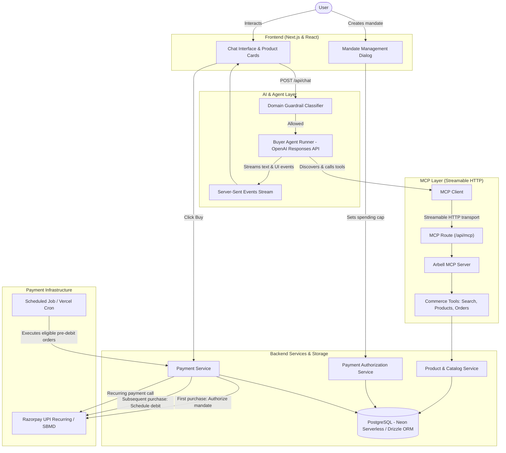
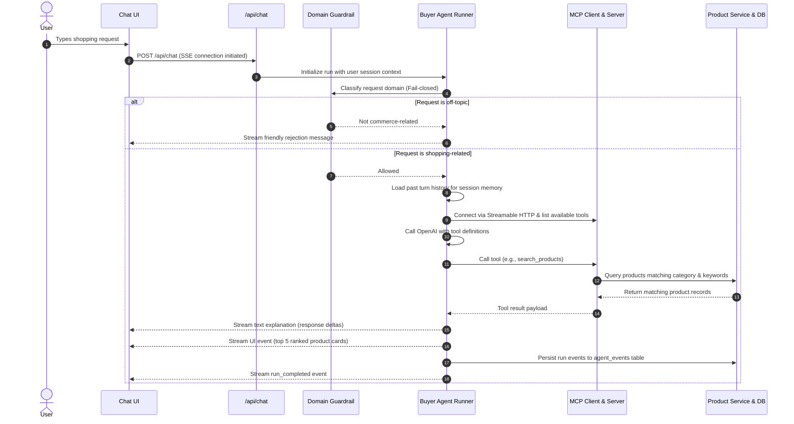
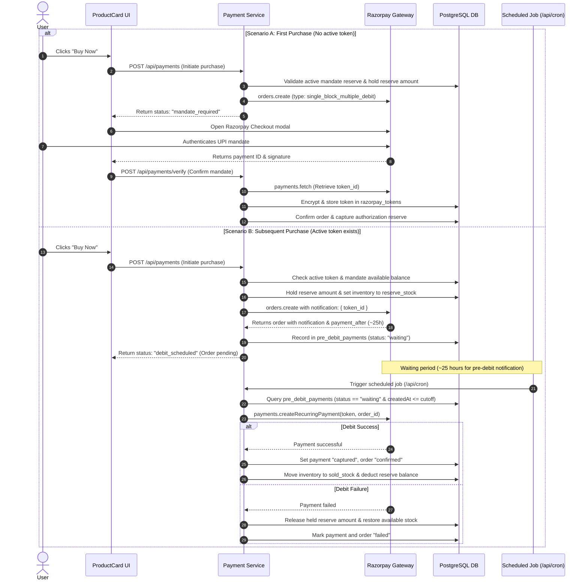

# Arbell

Live Demo: https://arbell-one.vercel.app/

Arbell is an AI-powered e-commerce platform that combines conversational product discovery with automated payments. 

In standard online shopping, buyers spend considerable time searching catalogs, filtering product lists, navigating checkout funnels, and authenticating every purchase with an OTP or UPI PIN. Arbell simplifies this by pairing an AI buyer assistant with a pre-authorized payment mandate system.

Users interact with Arbell through a conversational chat interface. Instead of manual filtering, users describe what they need in natural language (for example, "Find me a lightweight laptop with 16GB RAM under 60,000"). The AI assistant understands the intent, verifies it through guardrails, queries the product catalog using Model Context Protocol (MCP) tools, and returns recommendations accompanied by interactive product cards directly in the chat stream.

To streamline purchases, users create a payment authorization (or mandate reserve) with a spending limit and a validity period (e.g., up to 30 days). Once the user authorizes this mandate, purchases made through the platform are automatically drawn from this reserved amount until the mandate expires or the limit is reached, removing repetitive checkout steps for subsequent purchases.

---

## High-Level Architecture

Arbell is built as a full-stack Next.js application where the chat UI, AI agent layer, MCP server, backend services, relational database, and payment gateway communicate through structured contracts.



---

## Request Flow

When a user submits a shopping request in the chat interface, the following flow is executed:



1. **User Request**: The user sends a natural language prompt via the chat UI.
2. **Domain Guardrail**: Before any tools or LLM loops run, an OpenAI structured-output classifier checks whether the prompt is strictly commerce/shopping-related. If off-topic, the request is immediately rejected to conserve resources.
3. **Session Context**: The agent runner loads previous conversational turns from the database for the active session, maintaining memory of user preferences and budgets across turns.
4. **Tool Discovery & Execution**: The agent connects to the MCP server over Streamable HTTP, lists available tools, and invokes the relevant tool (e.g., `search_products`).
5. **Database Search**: The product service executes a query against PostgreSQL, matching keywords against indexed attributes, category, stock availability, and price range.
6. **Response & UI Streaming**: The agent generates a natural language summary and extracts the top-ranked products, emitting typed Server-Sent Events (`text_delta` and `ui` product grid) so product cards render dynamically in the interface.
7. **Audit Logging**: Every event (`run_started`, `tool_called`, `tool_completed`, `run_completed`) is persisted in the database for auditing and session reconstruction.

---

## Payment Flow & Razorpay Integration

Arbell uses **Razorpay UPI Recurring Payments (Single Block Multiple Debit / SBMD)**. This allows users to create a pre-authorized payment cap, from which subsequent purchases can be debited automatically without manual credential entry on each purchase.

### RBI Mandate & Pre-Debit Notification Rules

Under the Reserve Bank of India (RBI) regulations implemented by Razorpay:
- Any automated recurring debit requires an advance **pre-debit notification** sent to the customer at least 24 hours before the actual charge.
- Razorpay schedules this notification and provides a `payment_after` timestamp (typically 25 hours after notification scheduling).
- The debit cannot be executed immediately for recurring transactions; it must wait until the 25-hour pre-debit window has elapsed.

### Payment Lifecycle



### Mandate Creation & Balance Tracking

Users create a mandate through the interface by defining an authorization limit between ₹500 and ₹15,000 with an expiry between 5 and 30 days. The database tracks:
- `authorizedAmount`: The total spending limit approved.
- `remainingAmount`: The available balance for new purchases.
- `reserveAmount`: Funds currently placed on hold while an order waits for pre-debit processing.
- `spentAmount`: Funds successfully debited for confirmed orders.

When a purchase is initiated, the required amount is moved from `remainingAmount` to `reserveAmount`. If the recurring debit succeeds, the amount is captured into `spentAmount`. If it fails or is canceled, the held amount is released back to `remainingAmount`.

---

## AI & Agent Architecture

### Model & Streaming
The buyer agent uses OpenAI's Responses API (`openai.responses.create`) with streaming enabled. As the model streams response chunks, Server-Sent Events are published in real time:
- `text_delta`: Tokens of the agent's explanation as they are generated.
- `tool_started` / `tool_completed`: Live status updates indicating which tools are currently running.
- `ui`: A structured payload containing the top 5 relevant products, allowing the frontend to render interactive product cards.

### Model Context Protocol (MCP)
Arbell implements the official `@modelcontextprotocol/sdk` to separate tool definitions and execution from the agent logic:

- **MCP Server** (`src/mcp/server.ts`): Registers tools with typed schemas (using Zod) and handles execution. It is served through Next.js route handlers at `/api/mcp`.
- **Transport**: Uses `WebStandardStreamableHTTPServerTransport` and `StreamableHTTPClientTransport`. This streamable HTTP transport operates statelessly, making it compatible with serverless deployments.
- **Authentication**: Requests between the MCP client and server are authenticated via a Bearer token (`MCP_AUTH_TOKEN`).
- **MCP Client** (`src/mcp/client/mcp.client.ts`): Connects to `/api/mcp`, discovers tools at runtime, and exposes a tool-calling interface to the agent runner.
- **Tool Adapter** (`src/mcp/client/mcp.tool-adapter.ts`): Converts MCP tool JSON schemas into function definitions compatible with OpenAI tool calls.

### Exposed MCP Tools

| Tool Name | Description |
| :--- | :--- |
| `search_products` | Searches products by category, search keywords, merchant, price range, and stock availability. |
| `get_product` | Fetches details and specifications of a single product by its UUID. |
| `get_categories` | Lists all supported product categories. |
| `compare_products` | Retrieves multiple products side-by-side by their IDs for comparative evaluation. |
| `get_merchant` | Fetches merchant information by merchant UUID. |
| `get_order` | Retrieves details for a specific order. |
| `get_user_orders` | Lists all past orders belonging to a specific user. |

### Dynamic UI Streaming Pattern
Rather than having the agent dump raw JSON or formatted tables into text, the runner captures products returned from MCP tool calls, ranks them by availability and rating, and emits a typed UI event (`UIProductGridEvent`). The frontend intercepts this event and renders full interactive product cards with direct "Buy Now" actions.

---

## Core Project Structure

```
arbell/
├── src/
│   ├── agent/                 # AI Buyer Agent core implementation
│   │   ├── buyer/             # Public agent interface and configuration
│   │   ├── core/              # Execution loop (agent-runner.ts) and event types
│   │   ├── guardrail/         # Domain classifier to filter non-shopping requests
│   │   ├── prompts/           # Buyer agent system instructions
│   │   └── transport/         # SSE streaming response formatter and stream builder
│   │
│   ├── mcp/                   # Model Context Protocol implementation
│   │   ├── client/            # MCP client and adapter for OpenAI tool calling
│   │   ├── server.ts          # MCP server instance and tool registration
│   │   └── tools/             # Commerce tool implementations (products, orders, merchants)
│   │
│   ├── db/                    # Database layer
│   │   └── schema.ts          # Drizzle ORM schema (users, products, orders, payments, tokens)
│   │
│   ├── jobs/                  # Background and scheduled tasks
│   │   └── payment/           # Cron task processing pre-debit eligible payments
│   │
│   ├── services/              # Core business logic
│   │   ├── payment-service/   # Razorpay SBMD flow, token encryption, and webhooks
│   │   ├── payment-authorization-service/ # Universal mandate reserve management
│   │   ├── product-service/   # Catalog search, filtering, and category validation
│   │   ├── order-service/     # Order lifecycle management
│   │   └── chat-service/      # Chat history and session persistence
│   │
│   ├── components/            # UI components
│   │   ├── chat-layout.tsx    # Chat conversation layout and SSE event listener
│   │   ├── product-card.tsx   # Interactive product card with checkout trigger
│   │   ├── mandates-view.tsx  # User mandate dashboard and balance tracking
│   │   └── create-mandate-dialog.tsx # Dialog to set up new payment authorization
│   │
│   ├── app/                   # Next.js App Router
│   │   ├── api/chat/          # SSE endpoint for agent interactions
│   │   ├── api/mcp/           # Streamable HTTP MCP server route
│   │   ├── api/payments/      # Payment initiation, verification, and webhooks
│   │   ├── api/payment-authorizations/ # CRUD routes for user mandates
│   │   └── api/cron/          # Webhook / cron endpoint to process waiting debits
│   │
│   └── lib/                   # Shared client initializations
│       ├── openai.ts          # OpenAI SDK client instance
│       ├── razorpay.ts        # Razorpay SDK client instance
│       └── index.ts           # Neon Serverless PostgreSQL Drizzle connection
│
├── vercel.json                # Vercel Cron configuration for /api/cron
└── package.json               # Dependencies and scripts
```

---

## Key Features

- **Conversational Product Discovery**: Users describe needs in natural language, and the AI agent locates the best matching products from the database.
- **Fail-Closed Domain Guardrail**: Off-topic questions (e.g., general coding, trivia) are filtered out before calling tools or consuming LLM execution loops.
- **Multi-Turn Context**: Past session events are loaded so the agent remembers user preferences and constraints across turns.
- **Model Context Protocol Integration**: Standardized MCP tools decoupled from model logic, served over stateless Streamable HTTP.
- **Single Block Multiple Debit (SBMD) Mandates**: Allows users to set up a budget cap and purchase without entering payment details for every transaction.
- **Automated Pre-Debit Compliance**: Follows the 25-hour pre-debit notification window required by RBI e-mandate rules, with automatic debit execution through scheduled background jobs.
- **Encrypted Token Management**: Razorpay recurring payment tokens are encrypted using AES-256 before being stored in the database.
- **Real-Time UI Streaming**: Streams both conversational text and rich interactive product cards directly into the chat.